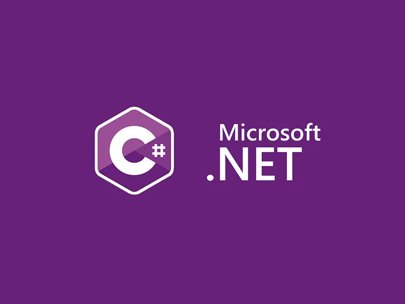
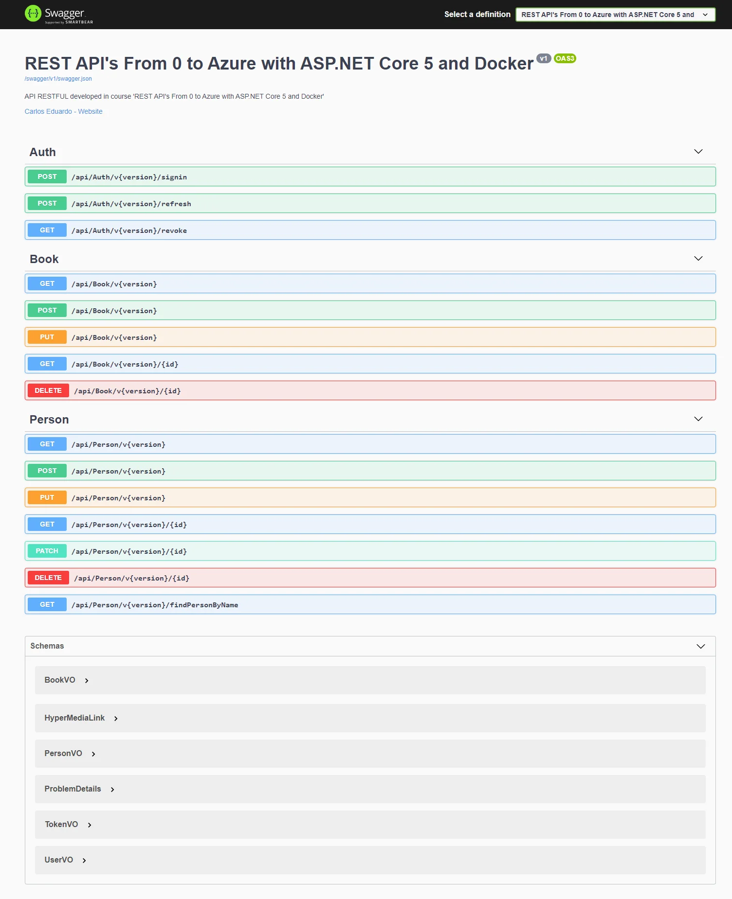

# asp.net-core-5-curso

Repositório destinado à upload dos conteúdos aprendidos no curso - REST API's RESTFul do 0 à Azure com ASP.NET Core 5 e Docker - ministrado por Leandro Costa

Aplicação desenvolvida utilizando a ferramenta Swagger

